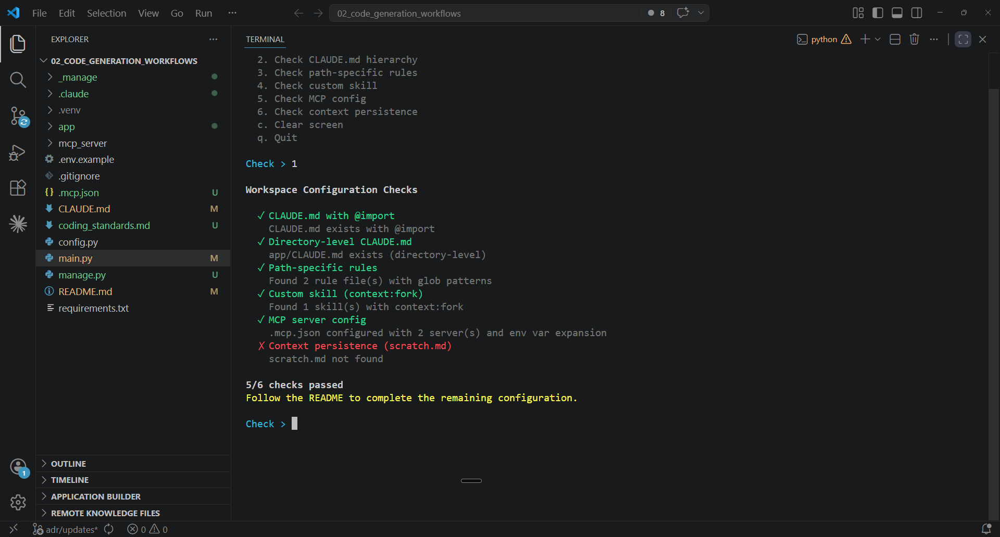

# Lab 02 | Code Generation with Claude Code

## Objective

Configure a Claude Code workspace from scratch: build a CLAUDE.md hierarchy with `@import`, create path-specific rules for different file types, set up a custom skill with `context:fork` isolation, configure MCP servers, and manage sessions across boundaries with resume and fork. By the end you will have a fully configured workspace where Claude Code understands your project conventions, applies the right rules to the right files, and can maintain context across sessions. All grounded in exam concepts you can trace back to specific task statements.



> **Note:** This lab is Claude Code configuration, not a Python script. `main.py` is a helper that validates your setup. The real work happens in config files and Claude Code sessions.

---

## Exam coverage

**Scenario:** S2 — Code Generation with Claude Code
**Domains:** D3 · D5

| Task | Statement |
|------|-----------|
| 1.7 | Manage session state, resumption, and forking |
| 2.4 | Integrate MCP servers into Claude Code and agent workflows |
| 3.1 | Configure CLAUDE.md hierarchy, scoping, and modular organization |
| 3.2 | Create and configure custom slash commands and skills |
| 3.3 | Apply path-specific rules for conditional convention loading |
| 3.4 | Determine when to use plan mode vs direct execution |
| 3.5 | Apply iterative refinement techniques for progressive improvement |
| 5.4 | Manage context effectively in large codebase exploration |

---

## Lab guide

### Step 0 — Open the lab folder

Open the **`02_code_generation_workflows/`** folder in VSCode.
Launch Claude Code from the terminal inside this folder.
This ensures Claude Code loads the lab's own `CLAUDE.md`.

### Step 1 — Create a Python virtual environment

```bash
python -m venv .venv
source .venv/bin/activate   # macOS/Linux
.venv\Scripts\activate      # Windows
```

### Step 2 — Configure

```bash
cp .env.example .env
```

Edit `.env` and add your Anthropic API key.

```bash
pip install -r requirements.txt
```

### Step 3 — Run the validation script

```bash
python main.py
```

Type `1` to run all checks. All 6 should fail — nothing is configured yet. This gives you a roadmap of what you will build:

1. CLAUDE.md with `@import`
2. Directory-level CLAUDE.md
3. Path-specific rules with glob patterns
4. Custom skill with `context:fork`
5. MCP server config with env var expansion
6. Context persistence (scratch.md)

Each subsequent step configures one piece. Re-run the checks after each step to watch your progress.

### Step 4 — Build the CLAUDE.md hierarchy

#### 4.1 Test

Type `2` to check the CLAUDE.md hierarchy. Both checks fail — the project-level CLAUDE.md exists but does not use `@import`, and there is no directory-level CLAUDE.md in app/.

#### 4.2 The problem

The CLAUDE.md has lab conventions, but it is a single monolithic file. In a real project, conventions grow: API standards, testing patterns, security policies. Keeping everything in one file becomes unwieldy. Claude Code supports two mechanisms for modular organization:

- **`@import`** — reference external files from CLAUDE.md. Claude Code loads them as if their content were inline.
- **Directory-level CLAUDE.md** — scoped conventions that load only when Claude Code works on files in that directory.

And there is a hierarchy to understand:
- **User-level** (`~/.claude/CLAUDE.md`) — personal preferences, not shared via version control
- **Project-level** (this lab's `CLAUDE.md`) — shared with teammates via version control
- **Directory-level** (e.g., `app/CLAUDE.md`) — scoped to a specific directory

#### 4.3 The fix

First, create a coding standards file to import. Create `coding_standards.md` in the project root (same directory as `CLAUDE.md`, not inside `app/`):

```markdown
# Coding Standards

## Function naming
- Use verb_noun format: get_product, update_stock, calculate_total
- Prefix validation functions with validate_
- Prefix formatting functions with format_

## Error handling
- Return None for not-found cases, never raise exceptions in lookup functions
- Validate inputs at the start of each public function
- Use descriptive variable names for error states

## Data formats
- Product IDs use "PROD-XXX" format
- Prices are floats rounded to 2 decimal places
- Stock quantities are non-negative integers
```

Now add the `@import` to CLAUDE.md. Open `CLAUDE.md` and add this line at the very top, before the first heading:

```
@import coding_standards.md
```

Finally, create a directory-level `app/CLAUDE.md`:

```markdown
# App Code

This directory contains the sample application for the lab.

## Conventions
- All functions use snake_case naming
- Products use "PROD-XXX" ID format
- Test files use the .test.py suffix and unittest framework
- Keep functions small — each function does one thing
```

#### 4.4 What to observe

Type `2` to re-run the hierarchy check — both should pass now.

- The `@import` makes CLAUDE.md modular — standards live in their own file, easy to update independently
- `app/CLAUDE.md` loads only when Claude Code edits files inside app/
- User-level settings (`~/.claude/CLAUDE.md`) would not be shared with teammates — if a new team member is missing instructions, check whether they were set at user-level instead of project-level

#### 4.5 Exam concept

CLAUDE.md hierarchy: user-level, project-level, directory-level. Use `@import` to keep CLAUDE.md modular. Use `.claude/rules/` directory (next step) as an alternative to monolithic CLAUDE.md. Diagnose hierarchy issues — a common problem is conventions set at user-level that are not shared via version control. [Task 3.1]

### Step 5 — Add path-specific rules

#### 5.1 Test

Type `3` to check path-specific rules — fails because `.claude/rules/` does not exist yet.

#### 5.2 The problem

The directory-level CLAUDE.md in app/ applies to all files in that directory equally. But test files (`*.test.py`) need different conventions than production code — different assertion patterns, different naming, mock usage guidance. And this applies to test files anywhere in the project, not just in app/. You cannot solve this with directory-level CLAUDE.md files — you would need one in every directory that contains tests. Path-specific rules with glob patterns solve this: apply conventions to file types regardless of directory.

#### 5.3 The fix

Create the rules directory:

```bash
mkdir -p .claude/rules
```

Create `.claude/rules/test-conventions.md`:

```markdown
---
paths:
  - "**/*.test.py"
---

# Test File Conventions

- Use unittest.TestCase for all test classes
- Name test methods with test_ prefix describing the scenario: test_existing_product, test_empty_order
- One assertion per test method when possible
- Use setUp() for shared test fixtures, not repeated initialization
- Test both success and failure cases for every function
- Use assertIsNone for None checks, not assertEqual(result, None)
```

Create `.claude/rules/api-conventions.md`:

```markdown
---
paths:
  - "app/**/*.py"
  - "!**/*.test.py"
---

# API Code Conventions

- Every function must validate its inputs before processing
- Return None for not-found cases — never raise KeyError or similar
- Use type hints for function parameters and return values
- Keep functions under 20 lines — extract helpers for complex logic
- All dict lookups use .get() with a default, never direct key access
```

#### 5.4 What to observe

Type `3` to re-run the rules check — should pass now.

- `test-conventions.md` loads when Claude Code edits any `.test.py` file in any directory
- `api-conventions.md` loads when editing `.py` files in app/ — but NOT test files (the `!` prefix excludes them)
- Path-scoped rules load only when editing matching files, reducing irrelevant context and token usage
- Glob rules work across directories — no need for a CLAUDE.md in every folder

#### 5.5 Exam concept

`.claude/rules/` files with YAML frontmatter `paths` fields containing glob patterns. Path-scoped rules load only when editing matching files, reducing irrelevant context and tokens. Choose path-specific rules over subdirectory CLAUDE.md for conventions that apply to file types across the codebase (e.g., `**/*.test.py`). [Task 3.3]

### Step 6 — Create a code review skill

#### 6.1 Test

Type `4` to check custom skills — fails because `.claude/commands/` does not exist.

#### 6.2 The problem

You want a reusable code review command that any team member can invoke. The review should analyze a file for quality issues and suggest improvements. But review output is verbose — it generates detailed findings, line references, and suggestions. If this output lands in the main conversation, it consumes context and makes subsequent interactions less effective. You need the review to run in isolation.

#### 6.3 The fix

Create the commands directory:

```bash
mkdir -p .claude/commands
```

Create `.claude/commands/review.md`:

```markdown
---
context: fork
allowed-tools:
  - Read
  - Glob
  - Grep
argument-hint: Path to the file to review
---

Review the file at $ARGUMENTS for code quality issues.

Check for:
1. Functions missing input validation
2. Functions missing docstrings
3. Direct dict key access without .get()
4. Functions longer than 20 lines
5. Missing error handling for edge cases

For each issue found, report:
- File and line number
- Issue category
- Suggested fix

Summarize the total number of issues by category at the end.
```

#### 6.4 What to observe

Type `4` to re-run the skill check — should pass now.

Now test the skill in Claude Code:

```
/review app/sample_app.py
```

- The skill runs in an isolated sub-agent (`context:fork`) — verbose review output stays in the fork, not the main conversation
- `allowed-tools` restricts the skill to Read, Glob, and Grep — it cannot Edit or Write files, keeping the review read-only
- `argument-hint` prompts the user for the file path when no argument is provided — `$ARGUMENTS` is replaced with what the user types
- The skill is in `.claude/commands/` (project-scoped) — committed to version control, available to all team members
- Personal skills would go in `~/.claude/commands/` — not shared via version control

#### 6.5 Exam concept

Project-scoped `.claude/commands/` for team-wide availability vs personal `~/.claude/commands/`. `context:fork` runs the skill in an isolated sub-agent, preventing verbose output from polluting the main conversation. `allowed-tools` restricts tool access during skill execution. `argument-hint` prompts for required parameters on invocation. [Task 3.2]

### Step 7 — Configure MCP servers

#### 7.1 Test

Type `5` to check MCP config — fails because `.mcp.json` does not exist.

#### 7.2 The problem

Claude Code's built-in tools (Read, Grep, Glob, Edit, Bash) handle most tasks. But real projects need external services — GitHub for PRs, Jira for tickets, databases for queries. MCP servers extend Claude Code with new tools. There are two decisions to make:

**Where to configure:**
- **Project-level** (`.mcp.json`) — shared with the team via version control. Use for tools everyone needs.
- **User-level** (`~/.claude.json`) — personal, not shared. Use for experimental or personal tools.

**What kind of server:**
- **Community servers** — pre-built, published packages for standard integrations (GitHub, Jira, web fetching). Prefer these over building your own when one exists.
- **Custom servers** — code you write for team-specific workflows that no community server covers.

#### 7.3 The fix

First, read `mcp_server/inventory_server.py` — a custom MCP server already included in the lab. It uses FastMCP (the Anthropic Academy pattern) to expose two tools and a resource:

- **`check_stock`** — look up a single product by ID
- **`search_products`** — search products by name keyword
- **`inventory://products`** resource — a catalog listing all products, so Claude Code can see what is available without making exploratory tool calls

The server reads `INVENTORY_SECRET` from the environment. If the variable is missing, tools return an auth error — this makes environment variable expansion observable.

Add `INVENTORY_SECRET=lab02_secret` to your `.env` file, then create `.mcp.json` at the lab root with both a community and a custom server:

```json
{
  "mcpServers": {
    "fetch": {
      "command": "python",
      "args": ["-m", "mcp_server_fetch"]
    },
    "inventory": {
      "command": "python",
      "args": ["mcp_server/inventory_server.py"],
      "env": {
        "INVENTORY_SECRET": "${INVENTORY_SECRET}"
      }
    }
  }
}
```

- **`fetch`** is a community server (`mcp-server-fetch`, installed via `requirements.txt`). It fetches any URL and returns markdown. No auth needed — it is a standard integration, so you use the community package instead of writing your own.
- **`inventory`** is a custom server (`mcp_server/inventory_server.py`). It serves your team's inventory data — no community server exists for this. `${INVENTORY_SECRET}` is expanded from the environment at runtime, so credentials never live in the config file.

Type `5` to run the MCP check — should pass.

#### 7.4 What to observe

**Restart Claude Code** (close and reopen, or type `/quit` and relaunch) so it discovers the new MCP servers. Then type:

```
/mcp
```

You should see both servers listed — `fetch` and `inventory` — with their tools and connection status. This confirms Claude Code discovered them at startup. Tools from all configured MCP servers are available simultaneously.

Now try the custom inventory server:

**Prompt for Claude Code:**
```
What products do we have in inventory with low stock?
```

Claude Code calls `check_stock` or `search_products` from the inventory MCP server — not Read or Grep on `app/sample_app.py`. The MCP tool descriptions are specific to inventory queries, so Claude Code prefers them over built-in tools.

Try the community fetch server:

**Prompt for Claude Code:**
```
Fetch https://docs.anthropic.com/en/docs/about-claude/models
and tell me what Claude models are currently available.
```

Claude Code uses the `fetch` tool from the community MCP server to retrieve the page. Both servers' tools were discovered at connection time and are available simultaneously.

#### 7.5 Exam concept

Project-level `.mcp.json` for shared team tooling vs user-level `~/.claude.json` for personal tools. Environment variable expansion (`${INVENTORY_SECRET}`) for credential management without committing secrets. Choose existing community MCP servers over custom implementations for standard integrations (e.g., web fetching, GitHub), reserving custom servers for team-specific workflows. MCP resources expose content catalogs to reduce exploratory tool calls. Tools from all configured MCP servers are discovered at connection time and available simultaneously. [Task 2.4]

### Step 8 — Plan mode and iterative refinement

#### 8.1 Plan mode

Claude Code can operate in **plan mode** (propose a plan, then execute on approval) or **direct execution** (act immediately). Choosing the right mode matters.

**Try plan mode** — toggle it on with `Shift+Tab` in Claude Code (or type `/plan`), then paste:

**Prompt for Claude Code:**
```
Refactor all functions in app/sample_app.py to add
input validation. Each function should check its inputs
and return a structured error dict with "error" and
"message" keys when validation fails. Also add type hints
to all function signatures.
```

Claude Code proposes a plan showing what it intends to change across the file. You review, suggest changes, or approve before any code is modified.

#### 8.2 Direct execution

Toggle plan mode off (`Shift+Tab`), then paste:

**Prompt for Claude Code:**
```
Fix the calculate_order_total function in
app/sample_app.py so it handles the case where a
product_id in the items list does not exist. It should
include a warning in the result instead of silently
skipping it.
```

Claude Code acts immediately — reads the file, makes the change, done. No plan step needed for a well-scoped single-function fix.

**When to use which:**
- **Plan mode:** multi-file edits, architectural decisions, refactoring that touches many functions, multiple possible approaches
- **Direct execution:** single-file bug fix with clear stack trace, well-scoped change with one obvious solution

#### 8.3 Iterative refinement

If sample_app.py was modified by the previous steps, restore it from the starter copy:

```bash
cp _manage/starter/app/sample_app.py app/sample_app.py
```

#### 8.3.1 Vague prompt

Start with a vague prompt in direct execution mode:

**Prompt for Claude Code:**
```
Improve the error handling in app/sample_app.py.
```

Claude Code may respond in one of two ways — both illustrate the problem with vague prompts:

- It may produce an inconsistent result that does not match what you had in mind.
- It may ask a clarifying question (e.g., "What kind of error handling improvements do you want?") — this is the **interview pattern**: Claude asks questions before implementing to surface unanticipated considerations. Useful, but it means your prompt was not specific enough to act on directly.

Either way, cancel the response (`Escape`) or dismiss the question — do not let it proceed. You are going to retry with a better prompt.

#### 8.3.2 Concrete examples

Now paste a prompt with explicit input/output examples:

**Prompt for Claude Code:**
```
Add input validation to app/sample_app.py functions.
Here are examples of the expected behavior:

get_product("") should return
{"error": True, "message": "product_id cannot be empty"}

get_product("INVALID") should return
{"error": True, "message": "must match PROD-XXX format"}

update_stock("PROD-001", "abc") should return
{"error": True, "message": "quantity must be an integer"}

calculate_order_total("not a list") should return
{"error": True, "message": "items must be a list"}
```

This time Claude Code acts immediately — no clarifying questions needed. Concrete examples produce consistent, predictable output. The model generalizes from your examples to handle similar cases across all functions.

#### 8.4 Exam concept

Plan mode for large-scale changes, multiple approaches, or multi-file edits. Direct execution for simple, well-scoped single-file changes. Use Explore subagent to isolate verbose discovery output and preserve the main context window. [Task 3.4]

Concrete input/output examples are the most effective way to communicate expected transformations. When prose descriptions produce inconsistent results, provide 2-3 targeted examples showing the exact behavior you want. Write test suites covering expected behavior and edge cases before implementation. Provide all interacting issues in a single message; iterate sequentially for independent issues. [Task 3.5]

### Step 9 — Manage sessions and persist context

#### 9.1 The problem

Long investigation sessions lose context. After enough back-and-forth, Claude Code summarizes older messages and the model starts referencing "typical patterns" instead of specific discovered classes and functions. When you close and reopen Claude Code, the session is gone. You need ways to:

- Resume a prior session with its full context
- Branch from a shared baseline to compare approaches
- Persist key findings outside the conversation where they survive context compression

#### 9.2 Start a session

This step uses the Claude Code **CLI** for session management (`--resume`, forking). If you have been using the Claude Code VSCode extension, open the **VSCode integrated terminal** and run the `claude` command directly:

```bash
claude
```

Ask Claude Code to analyze the app code:

**Prompt for Claude Code:**
```
List the function names in app/sample_app.py and write
them to scratch.md under a heading ## Functions.
```

Wait for Claude Code to create `scratch.md`. Then close the session (`/quit`).

#### 9.3 Resume and observe

#### 9.3.1 Make a change

Make a manual change to `app/sample_app.py` — add a new function at the bottom of the file:

```python
def get_low_stock_products(threshold=5):
    """Return products with stock below the threshold."""
    products = {
        "PROD-001": {"name": "Wireless Headphones", "price": 79.99, "stock": 45},
        "PROD-002": {"name": "USB-C Hub", "price": 49.99, "stock": 12},
        "PROD-003": {"name": "Mechanical Keyboard", "price": 129.99, "stock": 0},
    }
    low_stock = {}
    for pid, product in products.items():
        if product["stock"] < threshold:
            low_stock[pid] = product
    return low_stock
```

#### 9.3.2 Resume the session

Run `claude --resume` to list your past sessions and select the one you just closed:

```bash
claude --resume
```

Now paste:

**Prompt for Claude Code:**
```
I added a new function to app/sample_app.py since our
last session. Add it to scratch.md.
```

The agent has context from the prior session. It finds the new function and updates the scratchpad. Close the session (`/quit`).

**Important:** If tool results from the prior session are stale (e.g., files changed significantly), starting a new session with a structured summary of prior findings is more reliable than resuming with stale context. Use `--resume` when the prior context is still valid; use a fresh session with injected summary when it is not.

#### 9.4 Fork a session

`--fork-session` copies a session's conversation history into a new independent session — like `git branch` for conversations, not for files. The original session stays unchanged; the fork can go in a different direction.

```bash
claude --resume --fork-session    # fork a specific past session
claude --continue --fork-session  # fork the most recent session
```

**When to use it:**
- You have a long analysis session and want to try a risky refactor without losing the original conversation thread
- You want to explore two different approaches (e.g., testing strategies, architecture options) from the same shared analysis baseline
- A teammate wants to branch from your investigation and pursue a different angle

**What it does NOT do:** It does not create a file sandbox. Any file changes made in a fork are real — they persist on disk just like any other session. The fork only isolates the conversation history.

**Resume vs fork:**
- `--resume` continues the original session — everything you do becomes part of it permanently
- `--resume --fork-session` creates a copy — the original session stays frozen at that point

#### 9.5 Check the scratchpad

Type `6` in `main.py` to check the scratchpad — should pass if `scratch.md` was created.

The scratchpad file (`scratch.md`) persists findings across context boundaries:
- When the context window fills and older messages get summarized, scratchpad content survives in the file
- On resume, the agent can read `scratch.md` to recover key findings without relying on conversation memory
- Use `/compact` during extended exploration sessions to reduce context usage

#### 9.6 Exam concept

`--resume <session-name>` continues a specific prior conversation. `fork_session` creates independent branches from a shared analysis baseline — compare two approaches without contamination. Inform the agent about file changes on resume for targeted re-analysis. New session with structured summary is more reliable than resuming with stale tool results. Scratchpad files persist key findings across context boundaries; agents write to them and read on subsequent questions. Use `/compact` to reduce context usage during extended exploration. [Tasks 1.7, 5.4]

### Step 10 — Final validation

Run all checks one more time:

```bash
python main.py
```

Type `1` to run all checks. All 6 should pass:

1. ✓ CLAUDE.md with `@import`
2. ✓ Directory-level CLAUDE.md
3. ✓ Path-specific rules
4. ✓ Custom skill (`context:fork`)
5. ✓ MCP server config
6. ✓ Context persistence (scratch.md)

You now have a fully configured Claude Code workspace that:

- Loads project conventions from a modular CLAUDE.md hierarchy [Task 3.1]
- Applies path-specific rules to the right file types [Task 3.3]
- Has a team-wide review skill with isolated execution [Task 3.2]
- Connects to external tools via MCP with secure credential handling [Task 2.4]
- Supports plan mode for complex changes and direct execution for simple fixes [Task 3.4]
- Uses concrete examples for consistent iterative refinement [Task 3.5]
- Manages sessions with resume and fork for long-running investigations [Task 1.7]
- Persists findings in a scratchpad that survives context compression [Task 5.4]

---

## Lab management

### Restart

```bash
python manage.py restart
```

Removes all generated config files (`.claude/`, `app/CLAUDE.md`, `coding_standards.md`, `.mcp.json`, `scratch.md`) and restores starter files to their original state. Your `.env` file is preserved — no need to re-enter your API key.

### Solve

```bash
python manage.py solve
```

Applies all configurations from the README. Run `python main.py` and type `1` to validate — all 6 checks should pass.

---

*v0.1 — 3/28/2026 — Alfredo De Regil*
