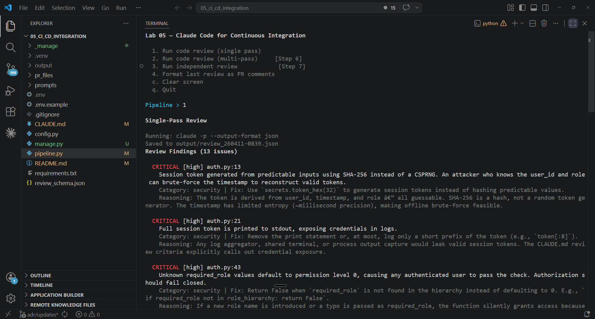

# Lab 05 | Claude Code for Continuous Integration

## Objective

Build a simulated CI pipeline where Claude Code reviews pull request code in non-interactive mode. You iteratively refine the review prompt, from broad and noisy to explicit criteria to few-shot examples, observing precision improve at each step. You then split reviews into per-file and cross-file passes, add independent review instances, and configure CLAUDE.md to provide project context to CI-invoked Claude Code. By the end you will have a working CI review pipeline that produces precise, structured feedback with calibrated confidence. All grounded in exam concepts you can trace back to specific task statements.



> **Note:** Like Lab 02, this lab combines Claude Code CLI usage with a Python orchestration script. `pipeline.py` simulates a CI runner that invokes Claude Code with the `-p` flag. The real learning happens by iteratively improving the review prompt and review architecture.

---

## Exam coverage

**Scenario:** S5 — Claude Code for Continuous Integration
**Domains:** D3 · D4

| Task | Statement |
|------|-----------|
| 1.6 | Design task decomposition strategies for complex workflows |
| 3.4 | Determine when to use plan mode vs direct execution |
| 3.5 | Apply iterative refinement techniques for progressive improvement |
| 3.6 | Integrate Claude Code into CI/CD pipelines |
| 4.1 | Design prompts with explicit criteria to reduce false positives |
| 4.2 | Apply few-shot prompting to improve output consistency and quality |
| 4.6 | Design multi-instance and multi-pass review architectures |

---

## Lab guide

### Step 0 — Open the lab folder

Open the **`05_ci_cd_integration/`** folder in VSCode.
Launch Claude Code from the terminal inside this folder.
This ensures Claude Code loads the lab's own `CLAUDE.md`.

### Step 1 — Create a Python virtual environment

```bash
python -m venv .venv
source .venv/bin/activate   # macOS/Linux
.venv\Scripts\activate      # Windows
```

### Step 2 — Configure

```bash
cp .env.example .env
```

Edit `.env` and add your Anthropic API key.

```bash
pip install -r requirements.txt
```

### Step 3 — Run the starter pipeline

Before running, orient yourself:

1. **Read `pipeline.py`** — the CI pipeline simulator. It loads the review prompt from `prompts/review_prompt.txt`, injects PR file contents and the JSON schema, and calls `claude -p --output-format json` via subprocess. The `-p` flag runs Claude Code non-interactively; `--output-format json` returns a structured JSON envelope.

2. **Read `prompts/review_prompt.txt`** — the starter review prompt. Notice how broad it is: "Be thorough and check everything" with a checklist that includes style, naming, and documentation. This intentionally generates noisy output. You will improve this in Steps 4 and 5.

3. **Browse `pr_files/`** — three Python files simulating a pull request (`auth.py`, `orders.py`, `utils.py`) plus an existing test file (`test_utils.py`). The source files contain bugs at varying severity levels and some acceptable patterns that a broad reviewer might incorrectly flag.

4. **Read `review_schema.json`** — the JSON schema for review output. Each finding has: `file`, `line`, `issue`, `severity`, `category`, `confidence`, `suggested_fix`, `reasoning`. The pipeline embeds this in the prompt so Claude conforms to it.

Now run the pipeline:

```bash
python pipeline.py
```

Type `1` to run a single-pass review.

#### 3.1 What to observe

- **The pipeline does not hang.** The `-p` flag runs Claude Code non-interactively — essential for CI. Without it, Claude Code waits for input and the pipeline stalls.
- **Output is structured JSON.** `--output-format json` returns a JSON envelope; the pipeline extracts the `result` field and parses findings. The schema is enforced via the prompt text.
- **But the findings are noisy.** The broad prompt asks for style, naming, and documentation checks, so Claude mixes genuine bugs with minor issues. Count findings and note how many are genuine versus noise. The review is saved to `output/` with a timestamp for later comparison.

#### 3.2 Exam concept

`-p` (or `--print`) for non-interactive CI mode. `--output-format json` for structured, machine-parseable output. Without `-p`, Claude Code hangs waiting for input in automated pipelines. The exam references `--json-schema` for guaranteed schema compliance via constrained decoding — this is a planned CLI feature. Today, schema compliance is enforced by including the JSON schema in the prompt and validating downstream. [Task 3.6]

### Step 4 — Replace vague criteria with explicit review criteria

#### 4.1 Test

Re-examine the review output from Step 3. Categorize each finding:
- **Genuine issue:** real bug, security vulnerability, or missing error handling
- **False positive:** minor style preference, naming opinion, or pattern that is acceptable in context

Count the false positives. A typical vague-prompt review produces 3-5 false positives alongside 4-6 genuine issues.

#### 4.2 The problem

The starter prompt lists six broad categories including style, naming, and documentation. Claude reports issues in every category, mixing genuine bugs with noise. General instructions like "be thorough" or "be conservative" fail to improve precision — specific categorical criteria do.

#### 4.3 The fix

Open `prompts/review_prompt.txt` and replace its entire contents with:

```
You are a code reviewer in a CI pipeline. Review the
code files below.

<review_criteria>
Report ONLY these categories:
- bug: Logic errors, off-by-one errors, incorrect
  conditions, missing edge case handling
- security: Credential exposure, injection
  vulnerabilities, missing authorization checks

Do NOT report:
- Naming convention preferences
- Missing docstrings or type hints
- Code style opinions (line length, import ordering)
- Patterns that are acceptable in context (e.g.,
  returning None for not-found cases is a deliberate
  API design choice, not error swallowing)

Severity levels:
- critical: Will cause incorrect behavior or security
  vulnerability in production
- warning: Could cause issues under specific conditions
  or edge cases
- info: Improvement suggestion, low risk if not
  addressed
</review_criteria>

<code_files>
{files_content}
</code_files>

<output_schema>
{output_schema}
</output_schema>

For each finding include: file, line number, issue
description, severity, category, confidence
(high/medium/low), suggested_fix, and reasoning
explaining why this is a genuine issue and not a
false positive.

Respond with ONLY a JSON object matching the schema
above. No markdown fences, no explanation — just the
JSON.
```

Run option `1` again.

#### 4.4 What to observe

- **Fewer findings overall.** Style and naming noise filtered out.
- **Higher precision.** Remaining findings should be genuine bugs or security issues.
- **Severity levels consistent.** Critical = production impact, warning = edge cases.
- **Comparison delta.** The pipeline compares with the previous review in `output/`. You should see a clear drop — style, naming, and documentation noise is gone.

> **Also know for the exam:** You can temporarily disable a high false-positive category entirely (e.g., remove "style" from the report list) to restore developer trust while improving prompts for that category. High false positive rates in one category undermine confidence in all categories. [Task 4.1]

#### 4.5 Exam concept

Explicit criteria outperform vague instructions. Specific categorical criteria (what to report vs skip) with concrete severity definitions produce consistent, actionable reviews. [Task 4.1]

This is the first iteration in the refinement loop: vague → explicit criteria. [Task 3.5]

### Step 5 — Add few-shot examples for consistent judgment

#### 5.1 Test

Look at the review output from Step 4. The explicit criteria improved category filtering, but some findings may still have:
- **Inconsistent format** — some findings have terse reasoning, others verbose
- **Ambiguous judgment** — patterns that could go either way (e.g., `parse_json_safe` returning None — is it error swallowing or a deliberate design?)

#### 5.2 The problem

Instructions tell Claude _what_ to look for but not _how_ to judge ambiguous cases or format findings consistently. Few-shot examples are the most effective technique when instructions alone produce inconsistent results.

#### 5.3 The fix

Open `prompts/review_prompt.txt` and add the following section between the `</review_criteria>` closing tag and the `<code_files>` opening tag:

```
<examples>
Here are examples of the expected review output and
judgment for ambiguous cases:

Example 1 — Genuine bug (REPORT):
{
  "file": "example.py",
  "line": 42,
  "issue": "Division by total_count without zero check",
  "severity": "critical",
  "category": "bug",
  "confidence": "high",
  "suggested_fix": "Add guard: if total_count == 0: return 0",
  "reasoning": "When total_count is 0, this raises
    ZeroDivisionError. The function is called from the
    reporting module where empty datasets are common."
}

Example 2 — Acceptable pattern (DO NOT REPORT):
A function returns None for not-found cases instead of
raising an exception. This is a deliberate API design
choice — the function docstring says 'returning None on
failure' and callers check the return value. Do not flag
returning None as error swallowing.

Example 3 — Security issue (REPORT):
{
  "file": "api.py",
  "line": 15,
  "issue": "User ID from request used without ownership
    verification",
  "severity": "critical",
  "category": "security",
  "confidence": "high",
  "suggested_fix": "Verify requesting user matches the
    resource owner before returning data",
  "reasoning": "Any authenticated user can access another
    user's data by changing the ID parameter. The auth
    module provides check_permission() but this endpoint
    does not call it."
}
</examples>
```

Run option `1` again.

#### 5.4 What to observe

- **Consistent format.** Every finding now follows the same structure with detailed reasoning.
- **Better ambiguous-case judgment.** The `parse_json_safe` function (returns None on failure) should NOT be flagged because Example 2 demonstrates that returning None is an acceptable pattern.
- **Reasoning quality.** Each finding explains _why_ it is genuine, not just what it is.
- **Generalization.** The model applies the judgment criteria to patterns not explicitly in the examples — it generalizes from "returning None is OK" to similar acceptable patterns across the codebase.
- **Comparison delta.** Check the comparison output — findings should be similar count to Step 4 but with more consistent formatting and fewer ambiguous-case false positives.

#### 5.5 Exam concept

Few-shot examples are the most effective technique for consistent output when instructions alone fail. They demonstrate ambiguous-case handling and enable generalization to novel patterns — distinguishing acceptable code patterns from genuine issues. [Task 4.2]

This is the second iteration: explicit criteria → few-shot examples. The three-step refinement (vague → explicit → few-shot) demonstrates iterative progressive improvement. [Task 3.5]

> **Also know for the exam:** Concrete input/output examples are the most effective way to communicate expected transformations when prose descriptions are interpreted inconsistently. Write test suites covering expected behavior before implementation. Use the interview pattern (have Claude ask questions) in unfamiliar domains. Provide all interacting issues in a single message; iterate sequentially for independent issues. [Task 3.5]

### Step 6 — Split into per-file and cross-file passes

#### 6.1 Test

Run option `1` (single-pass review) and look at whether it catches cross-file issues. `orders.py` defines `get_order()` without an auth check, even though `auth.py` provides `check_permission()`. A single-pass review of all three files at once may or may not catch this cross-file gap — attention gets diluted across files.

#### 6.2 The problem

A single-pass review sends all files at once. For large PRs, attention dilution causes the model to miss cross-file issues like missing auth checks or broken data flow between modules.

The solution: split into per-file local passes (each file in isolation) plus a cross-file integration pass for inter-module issues.

#### 6.3 The fix

Open `pipeline.py` and replace the entire `run_multi_pass` function (including the TODO comment) with:

```python
def run_multi_pass():
    """Run per-file passes plus a cross-file integration pass."""
    print(f"\n{BOLD}Multi-Pass Review{RESET}\n")

    previous = load_latest_review()
    source_files = get_source_files()
    all_findings = []

    # Phase 1: Per-file local passes
    total_passes = len(source_files) + 1
    for i, filename in enumerate(source_files, 1):
        print(f"{DIM}Pass {i}/{total_passes}: "
              f"Reviewing {filename}...{RESET}")
        file_content = load_single_file(filename)
        prompt = build_review_prompt(file_content)
        review = run_claude_review(prompt)
        if review and review.get("findings"):
            all_findings.extend(review["findings"])

    # Phase 2: Cross-file integration pass
    print(f"{DIM}Pass {total_passes}/{total_passes}: "
          f"Cross-file integration...{RESET}")
    files_content = load_pr_files()
    findings_json = json.dumps(all_findings, indent=2)
    schema = load_schema()
    template = load_integration_prompt()
    integration_prompt = template.replace(
        "{per_file_findings}", findings_json
    ).replace(
        "{files_content}", files_content
    ).replace(
        "{output_schema}", schema
    )
    integration_review = run_claude_review(
        integration_prompt
    )
    if integration_review:
        cross_findings = integration_review.get(
            "findings", []
        )
        all_findings.extend(cross_findings)

    # Combine and display
    combined = {
        "findings": all_findings,
        "summary": (
            f"Multi-pass: {len(source_files)} per-file "
            f"+ 1 integration, "
            f"{len(all_findings)} total findings"
        ),
    }
    save_review(combined)
    display_review(combined)
    compare_reviews(previous, combined)
```

Run option `2` (multi-pass review).

> **Note:** Multi-pass mode makes N+1 `claude -p` calls (one per file + one integration pass). This uses more API credits than single-pass. In production CI, per-file passes can run in parallel.

#### 6.4 What to observe

- **Per-file passes run sequentially.** Each file gets focused attention — local bugs in `auth.py`, `orders.py`, and `utils.py` are reviewed individually.
- **Cross-file pass catches integration issues.** The integration pass should find that `orders.py` never calls `check_permission()` from `auth.py`, and that `search_orders()` does not use `sanitize_input()` from `utils.py`.
- **More findings than single-pass.** The combined result typically surfaces 1-2 cross-file issues that the single-pass missed because attention was diluted.

#### 6.5 Exam concept

Fixed sequential pipelines (prompt chaining): analyze each file individually, then run a cross-file integration pass. This avoids attention dilution and is the recommended pattern for large code reviews. [Tasks 1.6, 4.6]

> **Also know for the exam:** For open-ended investigation tasks, use dynamic adaptive decomposition instead of fixed pipelines: map structure, identify high-impact areas, then create a prioritized adaptive plan that adjusts as dependencies are discovered. Prompt chaining is for predictable multi-aspect reviews; adaptive decomposition is for exploration. [Task 1.6]

### Step 7 — Independent review and confidence filtering

#### 7.1 Test

Look at the `confidence` field in the latest review output. Filter mentally:
- **High confidence findings:** are these all genuine issues?
- **Low confidence findings:** what fraction are false positives?

Low-confidence findings typically have a higher false positive rate than high-confidence ones. This correlation is what enables calibrated review routing.

#### 7.2 The problem

Two issues with the current pipeline:

**Self-review limitation.** A model that _generated_ code retains its reasoning context and is less likely to question its own decisions when reviewing. An independent instance — fresh context, no prior reasoning — catches more. In our pipeline each `claude -p` call is already independent, but this matters in systems where generation and review might share a session.

**Confidence calibration.** Not all findings are equally reliable. Per-finding confidence scores enable calibrated routing — high confidence blocks the PR, low confidence is informational.

#### 7.3 The fix

Open `pipeline.py` and replace the entire `run_independent_review` function (including the TODO comment) with:

```python
def run_independent_review():
    """Run two independent review instances and compare."""
    print(f"\n{BOLD}Independent Review Comparison{RESET}\n")

    previous = load_latest_review()
    files_content = load_pr_files()
    prompt = build_review_prompt(files_content)

    # Two independent reviews — each claude -p call
    # is a fresh session with no shared context [Task 4.6]
    print(f"{DIM}Running review instance 1...{RESET}")
    review_1 = run_claude_review(prompt)
    print(f"{DIM}Running review instance 2...{RESET}")
    review_2 = run_claude_review(prompt)

    if not review_1 or not review_2:
        print(f"{RED}One or both reviews failed.{RESET}\n")
        return

    # Compare by file:line location
    findings_1 = review_1.get("findings", [])
    findings_2 = review_2.get("findings", [])
    keys_1 = set(
        f"{f.get('file', '')}:{f.get('line', '')}"
        for f in findings_1
    )
    keys_2 = set(
        f"{f.get('file', '')}:{f.get('line', '')}"
        for f in findings_2
    )

    common = keys_1 & keys_2
    only_1 = keys_1 - keys_2
    only_2 = keys_2 - keys_1

    print(f"\n{BOLD}Comparison:{RESET}")
    print(f"  {GREEN}Both found:{RESET}      "
          f"{len(common)} finding(s)")
    print(f"  {YELLOW}Only reviewer 1:{RESET} "
          f"{len(only_1)} finding(s)")
    print(f"  {YELLOW}Only reviewer 2:{RESET} "
          f"{len(only_2)} finding(s)")

    if only_2:
        print(f"\n{BOLD}Unique from reviewer 2:{RESET}")
        for f in findings_2:
            key = (f"{f.get('file', '')}:"
                   f"{f.get('line', '')}")
            if key in only_2:
                print(f"  {f.get('file')}:{f.get('line')}"
                      f" — {f.get('issue', '')}")
    print()

    # Combine: all from reviewer 1 + unique from 2
    unique_from_2 = [
        f for f in findings_2
        if f"{f.get('file', '')}:{f.get('line', '')}"
        in only_2
    ]
    all_findings = findings_1 + unique_from_2
    combined = {
        "findings": all_findings,
        "summary": (
            f"Independent review: "
            f"{len(all_findings)} combined findings"
        ),
    }
    save_review(combined)
    compare_reviews(previous, combined)
```

Run option `3` (independent review).

#### 7.4 What to observe

- **Different instances find different things.** Two independent reviews produce partially overlapping but distinct findings. Issues both agree on have higher reliability.
- **Unique findings.** Each reviewer catches things the other missed.
- **In CI, independence is automatic.** Each `claude -p` call is a fresh session — the decision is whether to run a second pass, not how to isolate sessions.

Now type `4` to format the last review as PR comments. Examine the `confidence` field:
- **High confidence** findings are nearly always genuine issues
- **Low confidence** findings have a higher false positive rate
- In production, route high-confidence findings as blocking PR comments and low-confidence as informational suggestions

#### 7.5 Exam concept

Independent review instances (without prior reasoning context) are more effective than self-review. In CI, each `claude -p` invocation is inherently independent. Per-finding confidence scores enable calibrated routing — high confidence blocks the PR, low confidence is informational. [Task 4.6]

### Step 8 — CLAUDE.md context and plan mode

#### 8.1 CLAUDE.md as CI context

When `pipeline.py` runs `claude -p` from the lab directory, Claude Code loads this lab's `CLAUDE.md` automatically — the same file that guides interactive development also provides project context to CI runs.

Open `CLAUDE.md` and add this section at the bottom:

```markdown
### Existing test coverage

The following test files already exist. When generating
new tests, do NOT suggest tests for scenarios already
covered:

- `pr_files/test_utils.py` covers:
  - `validate_email`: valid format, missing @, missing
    domain, empty string
  - `format_currency`: positive amount, zero, None
  - `truncate_string`: short string, long string, empty
    string, exact length
```

Now try test generation. In Claude Code (interactive mode), paste:

**Prompt for Claude Code:**

```
Generate unit tests for the calculate_percentage and
sanitize_input functions in pr_files/utils.py. Check
CLAUDE.md for existing test coverage to avoid
duplicates. Write the tests to pr_files/test_utils_new.py
using unittest.TestCase.
```

#### 8.2 What to observe

- Claude Code reads CLAUDE.md and generates tests only for `calculate_percentage` and `sanitize_input` — not for functions already covered in `test_utils.py`.
- This prevents duplicate test suggestions in CI. The CLAUDE.md context travels with the repo — every team member and CI run benefits.
- Document testing standards and available fixtures in CLAUDE.md to improve test generation quality.

#### 8.3 Plan mode contrast

Every review so far used **direct execution** via `-p` — correct for CI automation. But what if a finding is complex and you want to investigate interactively? Toggle **plan mode** (`Shift+Tab` or `/plan`) and paste:

**Prompt for Claude Code:**

```
The code review flagged that orders.py get_order
function has no authorization check even though auth.py
provides check_permission. Investigate: where should the
auth check go, what would it look like, and what other
functions in orders.py have the same gap?
```

Plan mode proposes an investigation plan before acting. You review, adjust, and approve before any changes happen.

#### 8.4 When to use which

- **`-p` (direct execution):** CI pipelines, automated reviews, test generation — non-interactive, deterministic
- **Plan mode:** Complex investigation, multi-file refactoring, architectural decisions — interactive, exploratory
- **Combine them:** CI flags an issue with `-p`, the developer investigates interactively with plan mode

#### 8.5 Exam concept

CLAUDE.md provides project context (testing standards, fixtures, review criteria) to CI-invoked Claude Code. Include existing test files so test generation avoids duplicates. On re-runs after new commits, instruct Claude to report only new or unaddressed issues. [Task 3.6]

Plan mode for investigation, direct execution (`-p`) for CI automation. The Explore subagent (Lab 04) is the Agent SDK equivalent of plan mode's discovery phase. [Task 3.4]

> **Also know for the exam:** Sync API for blocking pre-merge checks; Message Batches API (50% cost savings, up to 24-hour processing window) for overnight/weekly analysis — covered in Lab 06. Batch API does not support multi-turn tool calling within a single request. Match API approach to workflow latency requirements. [Task 4.5]

---

## Lab management

### Restart

```bash
python manage.py restart
```

Restores all modified files to their original starter state with TODOs intact and deletes the `output/` directory. Your `.env` file is preserved — no need to re-enter your API key.

### Solve

```bash
python manage.py solve
```

Applies the completed solutions for all TODO sections, the refined review prompt, and the CLAUDE.md test coverage section. Run `python pipeline.py` to see the finished lab.

---

*v0.1 — 3/30/2026 — Alfredo De Regil*
