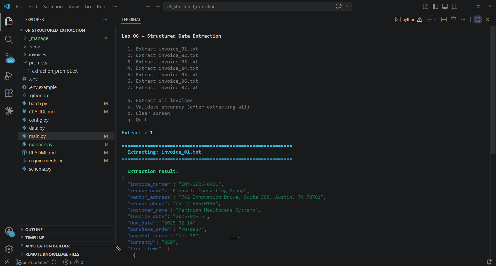

# Lab 06 | Structured Data Extraction

## Objective

Build an invoice extraction pipeline that converts unstructured documents into schema-compliant JSON using `tool_use` with forced `tool_choice`. You progressively add nullable fields, self-correction, retry with error feedback, few-shot examples, batch processing, and confidence-based human review routing. By the end you will have a working extraction system that handles missing fields, detects inconsistencies, and routes uncertain results to human review. All grounded in exam concepts you can trace back to specific task statements.



---

## Exam coverage

**Scenario:** S6 — Structured Data Extraction
**Domains:** D4 · D5

| Task | Statement |
|------|-----------|
| 4.2 | Apply few-shot prompting to improve output consistency and quality |
| 4.3 | Enforce structured output using tool use and JSON schemas |
| 4.4 | Implement validation, retry, and feedback loops for extraction quality |
| 4.5 | Design efficient batch processing strategies |
| 5.5 | Design human review workflows and confidence calibration |

---

## Lab guide

### Step 0 — Open the lab folder

Open the **`06_structured_extraction/`** folder in VSCode.
Launch Claude Code from the terminal inside this folder.
This ensures Claude Code loads the lab's own `CLAUDE.md`.

### Step 1 — Create a Python virtual environment

```bash
python -m venv .venv
source .venv/bin/activate   # macOS/Linux
.venv\Scripts\activate      # Windows
```

### Step 2 — Configure

```bash
cp .env.example .env
```

Edit `.env` and add your Anthropic API key.

```bash
pip install -r requirements.txt
```

### Step 3 — Run extraction on a clean invoice

#### 3.1 Orient yourself

The core design challenge: when you force a model to fill a JSON schema, **the schema constrains what it can output**. If a field requires a string, the model *must* return a string — even when the invoice doesn't have that information. It will fabricate a value rather than break the schema contract. Every schema decision in this lab gives the model a legitimate way to express "missing," "ambiguous," or "doesn't fit" — so downstream systems (accounts payable, dashboards) get honest data instead of silent guesses.

Open and skim three files:

1. **Read `schema.py`** — `extract_invoice_schema` defines a tool with no executable function. The model "calls" it with extracted fields as arguments. Notice two field types: `"type": "string"` in the `required` list (must provide a value) vs `"type": ["string", "null"]` excluded from `required` — these **nullable fields** let the model return JSON `null` instead of fabricating data. You modify this schema in Steps 4, 5, and 9.

2. **Read `main.py`** — find `extract_invoice()`. It forces `tool_choice` to `extract_invoice` and reads extracted data from `block.input`. The rest is stubs with TODOs you fill in over the next steps.

3. **Read `prompts/extraction_prompt.txt`** — format normalization rules (dates to YYYY-MM-DD, currency to plain numbers) and a `{few_shot_examples}` template variable (currently "No examples provided" — enabled in Step 7).

#### 3.2 Run the extraction

```bash
python main.py
```

The menu shows 7 invoices. Use `c` to clear, `q` to quit.

Type `1` to extract `invoice_01.txt` — a clean invoice from Pinnacle Consulting Group with all fields present.

#### 3.3 What to observe

- `tool_choice: {"type": "tool", "name": "extract_invoice"}` forces the model to call this specific tool. Without it, the model might return a text response instead of structured JSON.
- All fields are populated because invoice_01 has every field. The JSON output is schema-compliant by construction — `tool_use` guarantees this.
- Review routing shows `auto_approve` — the default stub (you'll implement real routing in Step 9).

Now type `2` to extract `invoice_02.txt` — TechForge Solutions. This invoice has no vendor phone number and no purchase order number.

- `vendor_phone` and `purchase_order` return `null` — actual JSON null, not a fabricated phone number. Code that checks `is None` works correctly; databases store it as NULL. If the schema forced a string, the model would return `"null"` (the four-character word) — which downstream code would treat as a real phone number.
- Compare `payment_terms` — a free-text string like `"Net 30"`. Works when terms are standard, but what about ambiguous terms? Step 4 addresses this.

#### 3.4 Exam concept

`tool_use` with a JSON schema is the most reliable method for schema-compliant structured output. Three `tool_choice` modes: **forced** (`{"type": "tool", "name": "..."}`) guarantees a specific tool runs, **"any"** guarantees some tool runs (useful when doc type is unknown and multiple schemas exist), **"auto"** lets the model decide (may return text instead). This lab uses forced — one extraction schema. [Task 4.3]

> **Also know for the exam:** Strict schemas eliminate JSON *syntax* errors but NOT *semantic* errors (fabricated values, totals that don't sum). Nullable prevents fabrication; validation (Step 5) and retry (Step 6) address other semantic issues. [Task 4.3]

### Step 4 — Handle missing fields gracefully

#### 4.1 Test

Type `4` to extract `invoice_04.txt` — Westfield Legal Associates. Look at `payment_terms` in the output. The invoice says "Per existing retainer agreement — see section 4.2 of engagement letter dated 09/15/2024, or Net 45 if retainer balance is insufficient." The model returns a free-text string like `"Net 45"` or `"Per retainer agreement"` — it picks one interpretation and commits to it.

Now type `5` to extract `invoice_05.txt` — Golden Plate Catering & Events. Look at `category`. This is a catering invoice for an employee luncheon. The model returns something like `"consulting"` or `"maintenance"` — none of the categories fit, but it has to pick one because the field is a plain string.

#### 4.2 The problem

A plain `type: "string"` means the model must return *some* string — it has no legitimate way to say "I'm not sure" or "this doesn't fit." So it picks an answer and commits. Your accounts payable system then routes the invoice based on that answer: it schedules payment for Net 45 when the actual terms require checking a retainer agreement, or it classifies a catering invoice under "consulting" when it should be flagged for a different approval workflow.

Nullable fields solved this for missing data (Step 3 — `vendor_phone` returns `null` instead of a fabricated number). But ambiguity and extensibility are different problems: the data *exists* in the document, it just doesn't map cleanly to a fixed value. The schema needs two more escape hatches — an enum with `"unclear"` for ambiguity, and an enum with `"other"` plus a detail string for categories that don't fit.

#### 4.3 The fix

Open `schema.py` and complete the two TODO comments for Step 4.

**Payment terms enum** — replace the plain string with an enum that includes `"unclear"`:

```python
"payment_terms": {
    "type": "string",
    "enum": ["net_15", "net_30", "net_45", "net_60",
             "due_on_receipt", "unclear"],
    "description": "Payment terms. Use 'unclear' when terms are ambiguous "
    "or reference external agreements.",
},
```

**Category with "other" + detail** — replace the plain string with an object:

```python
"category": {
    "type": "object",
    "properties": {
        "value": {
            "type": "string",
            "enum": ["consulting", "office_supplies",
                     "technology", "maintenance", "travel",
                     "utilities", "other"],
            "description": "Best-fit category for this invoice.",
        },
        "detail": {
            "type": ["string", "null"],
            "description": "Explanation when value is 'other'. Null otherwise.",
        },
    },
    "required": ["value"],
},
```

#### 4.4 What to observe

Re-run extraction on the same two invoices (`4` and `5`) and compare to what you saw in 4.1:

- **invoice_04** — payment terms should now be `"unclear"` instead of a guessed value. The model recognizes it cannot resolve a reference to an external agreement and says so explicitly.
- **invoice_05** — category should now be `{"value": "other", "detail": "..."}` with an explanation like "catering and event services" instead of forcing a bad fit into `"consulting"`.

#### 4.5 Exam concept

Three schema design patterns for the exam: **nullable** (`["string", "null"]`) for missing data, **enum with "unclear"** for ambiguous values, **enum with "other" + detail** for extensible categorization. The schema enforces structure; the prompt's format normalization rules (see `extraction_prompt.txt`) guide interpretation. [Task 4.3]

### Step 5 — Add self-correction for total mismatches

#### 5.1 The problem

Invoice_03 (BrightPath Office Supplies) states a total of $5,037.58. But the line items sum to $4,676.82, and 7.5% tax on that is $350.76, giving $5,027.58. The $10 difference ($5,037.58 vs $5,027.58) may indicate a rounding discrepancy or a data entry error. Right now the pipeline has no way to flag this.

#### 5.2 The fix — schema

Open `schema.py` and add the two fields from the Step 5 TODO:

```python
"calculated_total": {
    "type": "number",
    "description": "Sum of line item amounts plus tax. Computed by "
    "you independently of the stated total.",
},
"conflict_detected": {
    "type": "boolean",
    "description": "True when calculated_total differs from stated_total.",
},
```

Add `"calculated_total"`, `"conflict_detected"` to the `required` list.

#### 5.3 The fix — validation

Open `main.py` and complete the Step 5 TODO in `validate_extraction`:

```python
def validate_extraction(extraction):
    """Validate extracted data and return a list of error strings."""
    errors = []

    calculated = extraction.get("calculated_total")
    stated = extraction.get("stated_total")
    if calculated is not None and stated is not None:
        diff = abs(calculated - stated)
        if diff > 0.01:
            error = (
                f"Total mismatch: stated_total={stated}, "
                f"calculated_total={calculated}, difference={diff:.2f}"
            )
            errors.append(error)

    return errors
```

Type `3` to extract `invoice_03.txt`. The extraction should show `conflict_detected: true` and the validation should print the mismatch error.

#### 5.4 What to observe

- The model computes `calculated_total` independently by summing line items + tax
- `conflict_detected` is `true` because the totals differ
- The validation catches this and reports the specific discrepancy
- Invoice_03 has a volume discount note explaining the difference — the point is the pipeline flags it for review regardless

#### 5.5 Exam concept

Self-correction flows: requiring the model to independently calculate a derived value (calculated_total) and compare it to the stated value forces it to double-check its own extraction. The `conflict_detected` boolean provides a machine-readable flag for downstream routing. [Task 4.4]

### Step 6 — Add validation retry with error feedback

#### 6.1 Test

Type `7` to extract `invoice_07.txt` — Mike's Plumbing & Heating. This is an informal invoice with no invoice number, no PO, and no formal structure. Note how the pipeline currently has no way to catch or retry validation issues.

#### 6.2 The fix — validation checks

Complete the Step 6 TODO in `validate_extraction` to add the remaining checks. Add these lines after the total mismatch check:

```python
    # Check required fields are not None
    for field in ["invoice_number", "vendor_name", "invoice_date"]:
        if extraction.get(field) is None:
            errors.append(f"Required field '{field}' is null — info absent from document")

    # Check date format (YYYY-MM-DD)
    date_val = extraction.get("invoice_date", "")
    if date_val and not _is_valid_date(date_val):
        errors.append(f"Invalid date format: {date_val} (expected YYYY-MM-DD)")

    # Check line items are not empty
    items = extraction.get("line_items", [])
    if not items:
        errors.append("No line items extracted")

    return errors
```

#### 6.3 The fix — retry with feedback

Complete the Step 6 TODO in `retry_with_feedback`:

```python
def retry_with_feedback(client, invoice_text, extraction, errors, system_prompt):
    """Retry extraction, appending validation errors as feedback."""
    error_list = "\n".join(f"- {e}" for e in errors)
    failed_json = json.dumps(extraction, indent=2)
    messages = [
        {
            "role": "user",
            "content": (
                "Extract all fields from this invoice:\n\n"
                f"<invoice>\n{invoice_text}\n</invoice>"
            ),
        },
        {
            "role": "assistant",
            "content": [
                {
                    "type": "tool_use",
                    "id": "retry_call",
                    "name": "extract_invoice",
                    "input": extraction,
                }
            ],
        },
        {
            "role": "user",
            "content": [
                {
                    "type": "tool_result",
                    "tool_use_id": "retry_call",
                    "content": (
                        f"Validation failed. Fix these errors and re-extract:\n"
                        f"{error_list}\n\n"
                        f"Previous extraction:\n{failed_json}"
                    ),
                    "is_error": True,
                }
            ],
        },
    ]

    response = client.messages.create(
        model=MODEL,
        max_tokens=4096,
        system=system_prompt,
        tools=[extract_invoice_schema],
        tool_choice={"type": "tool", "name": "extract_invoice"},
        messages=messages,
    )

    for block in response.content:
        if block.type == "tool_use":
            return block.input
    return extraction
```

#### 6.4 Test — retryable error

Type `3` to extract `invoice_03.txt` — BrightPath Office Supplies. This invoice has a total mismatch (the stated total includes a volume discount note). The validation catches the discrepancy between `calculated_total` and `stated_total` — this is a **retryable** error because the model may have miscounted line items or misread the total.

**What to observe:**
- The validation prints the total mismatch error
- The retry fires — the pipeline passes the original invoice, the failed extraction, and the specific error back to the model via `is_error: True` on the tool result
- The model re-extracts with the feedback. It may correct the mismatch (if it miscalculated) or produce the same result (if the document genuinely has inconsistent totals). Either outcome is valid — the point is that the retry mechanism engaged.

#### 6.5 Test — non-retryable error

Now type `7` to extract `invoice_07.txt` — Mike's Plumbing & Heating. This informal invoice has no invoice number.

**What to observe:**
- The validation catches `invoice_number` as null — the error message says "info absent from document"
- The retry does **not** fire. The pipeline classifies this as non-retryable because the error contains "absent" — no amount of re-reading will make a missing invoice number appear
- Compare the two: invoice_03 triggered a retry, invoice_07 did not. The pipeline distinguishes errors the model might fix (format mismatches, calculation mistakes) from errors it cannot (data that isn't in the source document)

#### 6.6 Exam concept

Retry-with-error-feedback appends specific validation errors to the prompt alongside the original document and failed extraction. Effective for **retryable** errors (format mismatches, calculation mistakes). **Ineffective** for non-retryable errors where info is absent from the source — the pipeline must distinguish and skip. [Task 4.4]

> **Also know for the exam:** A `detected_pattern` field tracks which document constructs trigger failures (e.g., "European comma-decimal format"). This enables **dismissal pattern analysis** — if "missing PO" flags are always non-issues on informal invoices, suppress that check for that type. The `confidence.flags` array serves a similar role. [Task 4.4]

### Step 7 — Add few-shot examples

#### 7.1 The problem

The extraction works well on 7 invoices — but in production you process hundreds of document formats. Instructions alone produce inconsistent results at scale: null handling varies across runs, edge cases are resolved differently each time. Few-shot examples are the most effective technique for making extraction **consistent** — they show the model how to handle ambiguous cases concretely.

#### 7.2 The fix

Open `main.py` and complete the Step 7 TODO in `format_few_shot_examples`:

```python
def format_few_shot_examples(examples):
    """Format few-shot examples for the {few_shot_examples} template variable."""
    formatted = []
    for i, ex in enumerate(examples, 1):
        extraction_json = json.dumps(ex["extraction"], indent=2)
        block = (
            f"<example>\n"
            f"<invoice>\n{ex['document']}\n</invoice>\n"
            f"<correct_extraction>\n{extraction_json}\n</correct_extraction>\n"
            f"</example>"
        )
        formatted.append(block)
    result = "\n\n".join(formatted)
    return result
```

#### 7.3 What to observe

Open `data.py` and review `FEW_SHOT_EXAMPLES` — three example documents paired with correct extractions. Each one teaches a different pattern:

1. **Clean invoice** — all fields present, straightforward extraction. Establishes the baseline format.
2. **Sparse invoice** — missing vendor address, phone, invoice number, due date, PO. The correct extraction shows `null` for every missing field and `"unclear"` for unstated payment terms. This is the example that anchors the null pattern — it shows the model that returning `null` is the right answer, not fabrication.
3. **European format with total mismatch** — comma decimals (€9.500,00 → 9500.00), DD/MM/YYYY dates, and a stated total that doesn't match the line item sum. The correct extraction shows `conflict_detected: true` and a `"medium"` confidence flag. This teaches format normalization and self-correction in one example.

Run extraction on any invoice to confirm the examples are injected.

#### 7.4 Exam concept

Few-shot examples demonstrate **ambiguous-case handling**: when to return `null` vs `"unclear"` vs best-effort extraction. The model generalizes — it sees a French invoice with comma decimals and applies the same logic to a German one. Target 2-4 examples covering the most common ambiguous scenarios. [Task 4.2]

> **Also know for the exam:** Without an example showing `"vendor_phone": null`, the model's prior is to fill every field. A single null-handling example shifts this prior significantly. At scale, few-shot is the difference between constant human correction and reliable automation. [Task 4.2]

### Step 8 — Batch-process documents

#### 8.1 Orient yourself

Open `batch.py` and read `build_batch_requests()`. Each invoice becomes a `Request` with a `custom_id` (invoice filename, for matching results back to inputs) and `params` — the same parameters you pass to `client.messages.create()` in `main.py`. `MessageCreateParamsNonStreaming` and `Request` are SDK wrappers that validate before submission.

> **Note:** For full details on the Message Batches API, see the [batch processing documentation](https://platform.claude.com/docs/en/build-with-claude/batch-processing).

#### 8.2 Preview the batch

```bash
python batch.py
```

Type `1` to preview the batch requests (dry run).

#### 8.3 What to observe in the preview

- Each request has a `custom_id` derived from the invoice filename — this correlates results back to source documents
- Each request is independent — no shared state between requests
- `tool_choice` is forced to `extract_invoice`, same as the sync pipeline

#### 8.4 Exam concept — when to batch

The Message Batches API provides **50% cost savings** with a **24-hour processing window** and **no latency SLA**. Use it for:
- Overnight bulk extraction of incoming invoices
- Monthly reprocessing of an invoice backlog
- Prompt refinement: extract a **sample set** (e.g., 50 diverse invoices) via batch, review results, refine the prompt, then batch the full volume

Do NOT use it for:
- Pre-merge code review (blocking — needs sync API)
- Real-time customer support (latency-sensitive)
- Any workflow where a user is waiting for the result

**SLA calculation example:** If your accounts payable SLA requires invoices processed within 30 hours of receipt, and the batch API has a 24-hour window, you have a 6-hour buffer. You could batch every 4 hours to stay within SLA. If the SLA were 20 hours, batch processing would not meet the requirement — use the sync API instead. [Task 4.5]

> **Also know for the exam:** The batch API does **not** support multi-turn tool calling within a single request. Each request is a single turn. This is fine for extraction (one forced tool call), but if your workflow requires an agentic loop (tool call → result → another tool call), you must use the sync API. [Task 4.5]

#### 8.5 Submit (optional)

Type `2` to submit the batch. Save the batch ID. Use option `3` to check status and `4` to retrieve results.

Results may arrive in a **different order** than submitted — `custom_id` is the only reliable way to match. Failed requests can be resubmitted by `custom_id` with modifications (e.g., chunking oversized documents). [Task 4.5]

### Step 9 — Route to human review based on confidence

#### 9.1 The problem

This step addresses two related questions the exam tests:

**Confidence routing** — Right now every extraction shows `auto_approve` regardless of quality. A clean corporate invoice and an informal handwritten note both go straight to payment. The pipeline needs the model to self-report how confident it is, so you can route: high-confidence extractions go straight through, low-confidence ones go to a human, and a middle tier gets spot-checked. But the schema has no field for confidence — the model has no way to express it.

**Accuracy validation** — Even after adding confidence routing, how do you know the thresholds are right? A model that says "high confidence" on everything is useless. You need to compare extractions against known-correct values (a labeled validation set) to verify that "high" actually means accurate — and to check whether accuracy holds across different document types, not just in aggregate.

#### 9.2 The fix — schema

Open `schema.py` and add the confidence object from the Step 9 TODO:

```python
"confidence": {
    "type": "object",
    "properties": {
        "overall": {
            "type": "string",
            "enum": ["high", "medium", "low"],
            "description": "Overall extraction confidence.",
        },
        "flags": {
            "type": "array",
            "items": {"type": "string"},
            "description": "List of fields or issues with reduced confidence.",
        },
    },
    "required": ["overall", "flags"],
},
```

Add `"confidence"` to the `required` list.

#### 9.3 The fix — routing

Open `main.py` and complete the Step 9 TODO in `classify_review_need`:

```python
def classify_review_need(extraction):
    """Route an extraction to auto_approve, spot_check, or human_review."""
    confidence = extraction.get("confidence", {})
    overall = confidence.get("overall", "low")
    flags = confidence.get("flags", [])

    if overall == "high" and not flags:
        return "auto_approve"
    elif overall == "low" or len(flags) >= 3:
        return "human_review"
    else:
        return "spot_check"
```

#### 9.4 Try it — confidence routing

Run `python main.py`. Type `a` to extract all 7 invoices. Observe the review routing printed after each extraction:

- `invoice_01.txt` — clean corporate invoice, should route to `auto_approve`
- `invoice_05.txt` — catering with "other" category, likely `spot_check`
- `invoice_06.txt` — European format, likely `spot_check` (format conversion flags)
- `invoice_07.txt` — informal, missing fields, should route to `human_review` or `spot_check`

**What to observe:**
- Clean invoices get `high` confidence with no flags → `auto_approve`
- Invoices with missing fields or ambiguous terms get `medium` confidence with flags → `spot_check`
- Invoices with significant missing data get `low` confidence → `human_review`

#### 9.5 Try it — accuracy validation

Now type `v` to run the accuracy check against the labeled validation set in `data.py`.

**What to observe:**

The check compares your extractions against known-correct values for 4 invoices: invoice_01 (clean corporate), invoice_02 (technology, missing fields), invoice_06 (European format), and invoice_07 (informal handwritten). These four were chosen deliberately — they represent different document types in your corpus.

Imagine the accuracy check showed 92% overall. That sounds good. But what if it breaks down to: 100% on corporate invoices, 95% on technology invoices, 90% on European format, and 75% on informal handwritten? The 92% aggregate **masks** the fact that informal invoices fail 1 in 4 times. If you automated all extractions based on the aggregate number, every fourth informal invoice would go to payment with bad data. This is why the exam tests **stratified sampling** — measuring accuracy per document type and per field, not just overall.

#### 9.6 Exam concept

**Confidence routing:** The model outputs field-level confidence scores, and the pipeline routes based on them — high → auto_approve, medium → spot_check, low → human_review. This prioritizes limited reviewer capacity: humans spend time on extractions that actually need attention, not on clean invoices the model handled correctly. The routing thresholds must be **calibrated** using a labeled validation set, not guessed — the threshold for auto-approval depends on the cost of errors (a $50 office supply invoice vs a $50,000 consulting engagement). [Task 5.5]

**Accuracy validation:** Aggregate accuracy (e.g., "97% correct") masks poor performance on specific document types or fields. An extraction system might be 99% accurate on corporate invoices but 60% accurate on informal handwritten ones. **Stratified random sampling** — measuring accuracy per document type and per field — reveals these weaknesses. Only automate extraction for document types and fields where accuracy is validated. Validate by type AND by field before reducing human review. [Task 5.5]

---

## Lab management

### Restart

```bash
python manage.py restart
```

Restores all modified files to their original starter state with TODOs intact. Your `.env` file is preserved — no need to re-enter your API key.

### Solve

```bash
python manage.py solve
```

Applies the completed solutions for all TODO sections. Run `python main.py` to see the finished lab.

---

*v0.1 — 3/30/2026 — Alfredo De Regil*
