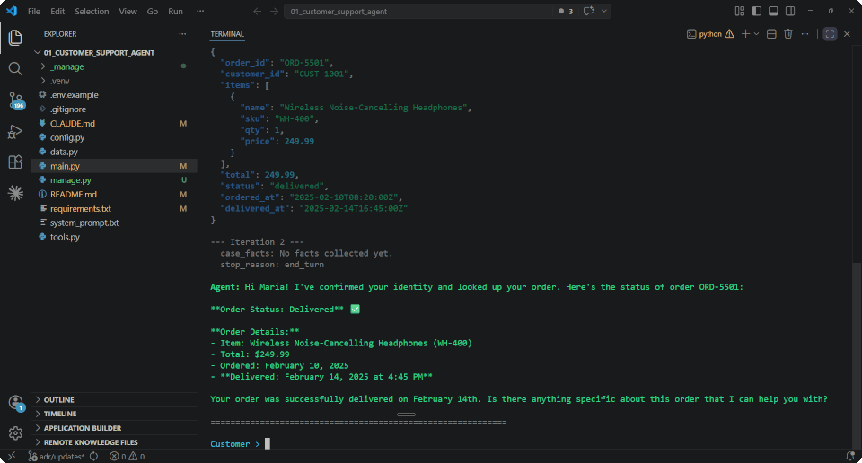

# Claude Certified Architect

**Guided labs for the CCA Foundations certification exam.**

Build working code for each of the 6 exam scenarios so you can apply the concepts before test day, not just study them. The labs cover all 5 domains and all 30 task statements from the official exam guide.



| Lab | Description | Coverage |
|-----|-------------|----------|
| **01**<br>[Customer Support Resolution Agent](01_customer_support_agent/) | A customer support agent with four tools, a manual agentic loop, a prerequisite gate, and a PostToolUse hook enforcing refund policy, using the Claude API. | **D1, D2, D5**<br>1.1, 1.2, 1.4, 1.5, 2.1, 2.2, 2.3, 5.1, 5.2 |
| **02**<br>[Code Generation with Claude Code](02_code_generation_workflows/) | A Claude Code workspace with CLAUDE.md hierarchy, path-specific rules, a `context:fork` skill, MCP servers, and session management with resume and fork. | **D3, D5**<br>1.7, 2.4, 3.1, 3.2, 3.3, 3.4, 3.5, 5.4 |
| **03**<br>[Multi-Agent Research System](03_multi_agent_research/) | A coordinator that delegates to four research subagents, handles structured errors from unavailable sources, and synthesizes cited reports with coverage gap annotations, using the Claude Agent SDK. | **D1, D2, D5**<br>1.2, 1.3, 1.5, 1.6, 2.1, 2.2, 2.3, 5.1, 5.3, 5.6 |
| **04**<br>[Developer Productivity with Claude](04_developer_productivity/) | A codebase exploration agent with built-in tools, an MCP docs server, an Explore subagent, scratchpad persistence, and a `context:fork` skill, using the Claude Agent SDK. | **D1, D2, D3, D5**<br>1.3, 2.1, 2.4, 2.5, 3.1, 3.2, 3.4, 5.4 |
| **05**<br>[Claude Code for Continuous Integration](05_ci_cd_integration/) | A simulated CI pipeline using Claude Code's `-p` flag: iterative prompt refinement, per-file and cross-file review passes, independent review instances, and CLAUDE.md project context. | **D3, D4**<br>1.6, 3.4, 3.5, 3.6, 4.1, 4.2, 4.6 |
| **06**<br>[Structured Data Extraction](06_structured_extraction/) | An invoice extraction pipeline with forced `tool_choice`, nullable fields, self-correction, validation-retry loops, few-shot examples, batch processing, and confidence-based human review routing, using the Claude API. | **D4, D5**<br>4.2, 4.3, 4.4, 4.5, 5.5 |

---

## How to Use

### Prerequisites

- Python 3.11+
- An [Anthropic API key](https://console.anthropic.com/)
- [Claude Code](https://docs.anthropic.com/en/docs/claude-code) (required for Labs 02 and 05)

### Setup

```bash
cd 0X_lab_name
python -m venv .venv

source .venv/bin/activate   # macOS/Linux
.venv\Scripts\activate      # Windows

cp .env.example .env        # add your ANTHROPIC_API_KEY
pip install -r requirements.txt

python main.py              # run the lab
```

---

## Coverage

  

These labs were carefully designed to cover every domain and task from the official exam guide, with a guided, educational approach that walks you through each concept step by step.

See the [Lab Reference](LAB_REFERENCE.md) for details of what domains and tasks are covered by each lab.

### Domains

| ID | Domain | Weight | Labs |
|:--:|--------|:------:|------|
| D1 | Agentic Architecture & Orchestration | 27% | **01, 02, 03, 04, 05** |
| D2 | Tool Design & MCP Integration | 18% | **01, 02, 03, 04** |
| D3 | Claude Code Configuration & Workflows | 20% | **02, 04, 05** |
| D4 | Prompt Engineering & Structured Output | 20% | **05, 06** |
| D5 | Context Management & Reliability | 15% | **01, 02, 03, 04, 06** |

---

## Disclaimer

This is an independent resource, not produced, endorsed, or affiliated with Anthropic.

[](LICENSE)
